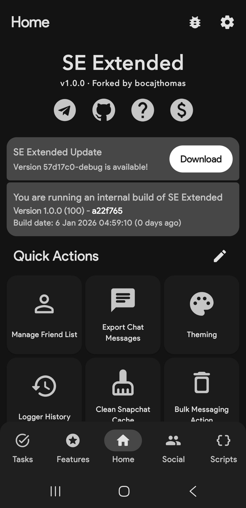
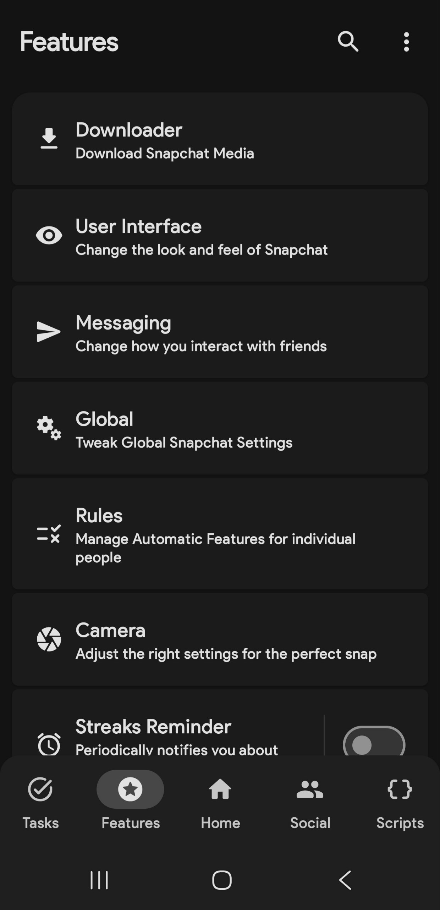
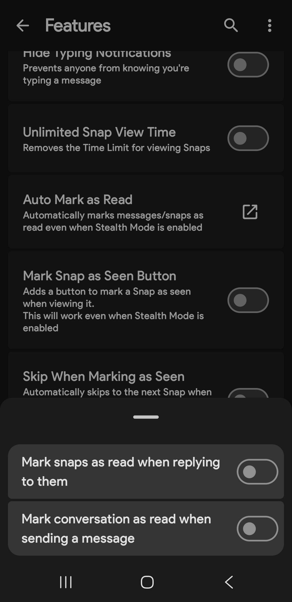
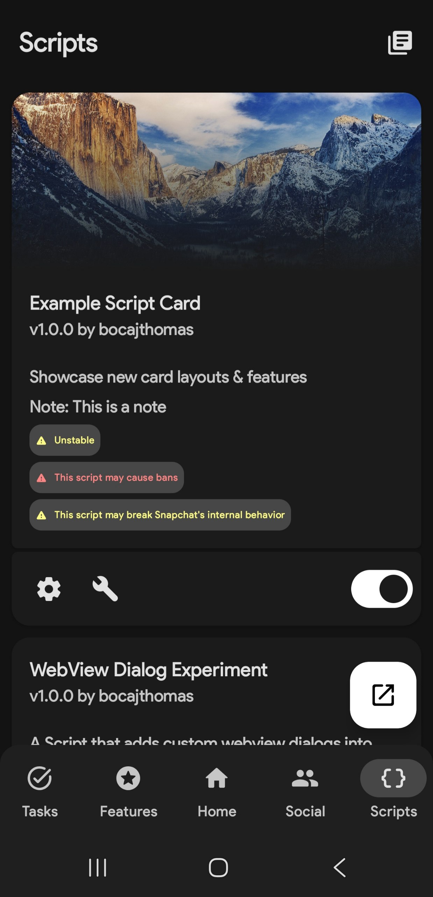
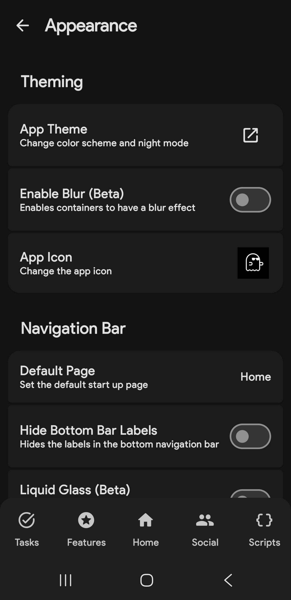
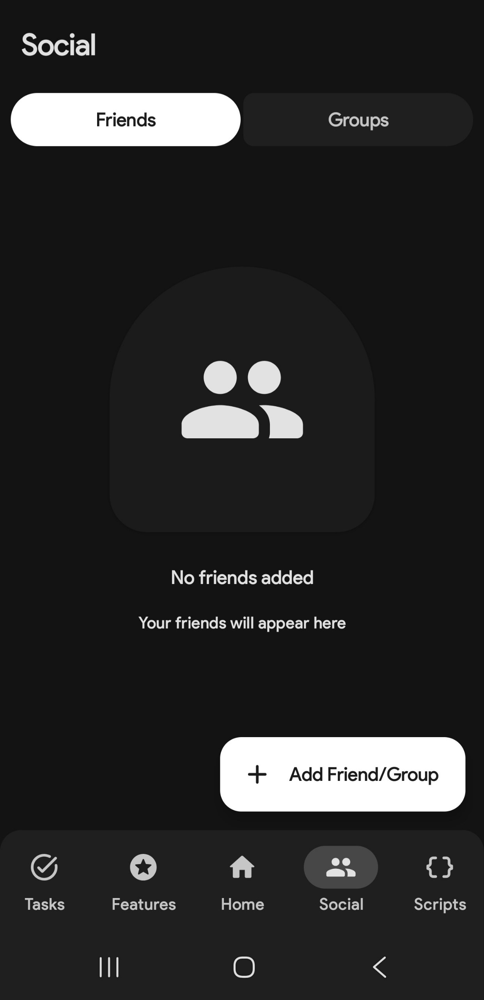
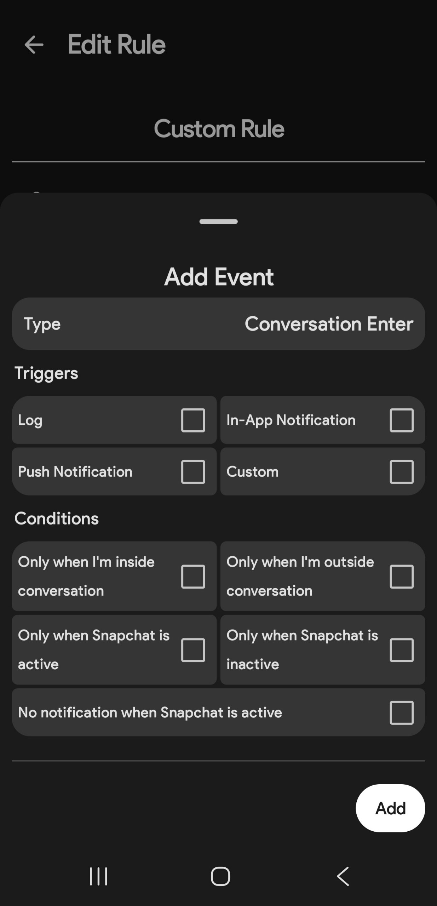
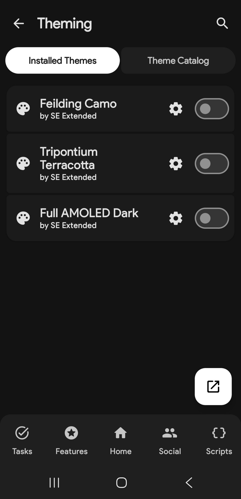

  

# SE Extended
**An Xposed module designed to extend Snapchat with power user features.**
 
**Supporting both `rooted` and `unrooted` devices**
<!-- Uncomment when v1.0.0 is released

-->
 

 

**Quick Links**

## Introduction
SE Extended is a fork of the original [SnapEnhance](https://github.com/rhunk/SnapEnhance) project that aims to provide extended features that power users want the most.  
While other forks today are shipping lazy AI-generated code, over cluttered UI, lying about their 'bypasses' to get user attention and locking builds behind paywalls, SE Extended does it differently, we actually respect the license, write our code by hand, keep everything 100% free, and offer a clean and modern UI thanks to Material 3 Expressive.
SE Extended does what others can't, by building a powerful Xposed module driven by user needs, not by profit or 'hype'.

## Screenshots

 

  
  
  
  
  
  
  
  
 

## Main Features

  
Media Downloader

- `Save Folder`
- `Auto Download Sources`
- `Prevent Self Auto Download`
- `Path Format`
- `Allow Duplicate`
- `Merge Overlays`
- `Force Image Format`
- `Force Voice Note Format`
- `Auto Download Voice Notes`
- `Download Profile Pictures`
- `Opera Download Button`
- `Download Context Menu`
- `FFmpeg Options`
- `Logging Options` (Logging & Disappearing Rate)
- `Custom Path Format`

  
User Interface

- `Friend Feed Menu Buttons`
- `Auto Close Friend Feed Menu`
- `Custom Theme`
- `Friend Feed Message Preview`
- `Custom Friend Feed Label`
- `Icon Style`
- `Snap Preview`
- `Bootstrap Override` (Default Home Tab & Persistent App Appearance)
- `Enhance Friend Map Nametags`
- `Prevent Message List Auto Scroll`
- `Show Streak Expiration Info`
- `Hide Friend Feed Entry`
- `Hide Streak Restore`
- `Hide Quick Add Suggestions`
- `Hide Story Suggestions`
- `Hide UI Components` (Voice Record button, Call Buttons, Etc)
- `Opera Media Quick Info`
- `Old Bitmoji Selfie`
- `Disable Spotlight`
- `Vertical Story Viewer`
- `Message Indicators`
- `Stealth Mode Indicator`
- `Edit Text Override`

  

  
Messaging

- `Bypass Screenshot Detection`
- `Anonymous Story Viewing`
- `Prevent Story Rewatch Indicator`
- `Hide Peek-a-Peek`
- `Hide Bitmoji Presence`
- `Hide Typing Notifications`
- `Unlimited Snap View Time`
- `Auto Mark As Read`
- `Mark Snap As Seen Button`
- `Skip When Marking As Seen`
- `Loop Media PlayBack`
- `Disable Replay In FF`
- `Half Swipe Notifier`
- `Call Start Confirmation`
- `Unlimited Conversation Pinning`
- `Auto Save Messages`
- `Prevent Message Sending`
- `Friend Mutation Notifier`
- `Better Notifications`
- `Notifications Blacklist`
- `Message Logger`
- `Gallery Media Send Override`
- `Strip Media Metadata`
- `Bypass Message Retention Policy`
- `Bypass Message Action Restrictions`
- `Remove Groups Locked Status`
 

  
Global

- `Better Location`
- `Snapchat Plus`
- `Media Upload Quality`
- `Disable Confirmation Dialogs`
- `Disable Metrics`
- `Disable Story Sections`
- `Block Ads`
- `Disable Custom Tabs`
- `Disable Permission Request`
- `Disable Memories Snap Feed`
- `Spotlight Comments Username`
- `Bypass Video Length Restriction`
- `Default Video Playback Rate`
- `Video Playback Rate Slider`
- `Disable Google Play Services Dialogs`
- `Default Volume Controls`
- `Disable Telecom Framework`
- `Hide Active Music`
- `Disable Snap Splitting`

  
Rules

- `Stealth Mode`
- `Auto Download`
- `Auto Save`
- `Auto Open Snaps`
- `Unsaveable Messages`

  
Camera

- `Disable Camera`
- `Immersive Preview`
- `Black Photos`
- `Front Custom Frame Rate`
- `Back Custom Frame Rate`
- `HEVC Recording`
- `Force Camera Source Encoding`
- `Custom Resolution`
- `Override Front Resolution`
- `Override Back Resolution`

Streaks Reminder

- `Interval`
- `Remaining Time`
- `Group Notifications`

  
Experimental

- `Native Hooks` (Custom Emoji Fonts, etc)
- `Spoof`
- `Convert Message Locally`
- `Media File Picker`
- `Story Logger`
- `Call Recorder`
- `Account Switcher`
- `Better Transcript`
- `Voice Note Auto Play`
- `Feiend Notes`
- `Edit Messages`
- `Context Menu Fix`
- `COF Experiments`
- `App Lock`
- `Infinite Story Boost`
- `My Eyes Only Passcode Bypass`
- `No Friend Score Delay`
- `Best Friend Pinning`
- `End-to-End Encryption`
- `Hidden Snapchat Plus Features`
- `Custom Streaks Expiration Format`
- `Add Friend Source Spoof`
- `Prevent Forced Logout`

 
Scripting

- `Developer Mode`
- `Module Folder`
- `Auto Reload`
- `Integated UI`
- `Old Tool Box Add View`
- `Disable Log Anonymization`

 
Friend Tracker

- `Record Messaging Events`
- `Allow Running In Background`
- `Auto Purge`

See [Changes Compared to SnapEnhance](https://github.com/bocajthomas/SE-Extended/wiki/Changes-Compared-to-SnapEnhance) for the full in depth changelog

## Download
To get SE Extended up and running please see the [`Installation-guide`](https://github.com/bocajthomas/SE-Extended/wiki/Installation-Guide),

## Contact
Join our [Telegram Channel](https://t.me/SE_Extended) for Discussions, announcements, and releases!

## Donate
Help us keep SE Extended growing! Your generous donation directly supports ongoing development, ensuring we can continue to bring you new features and improvements.  
Donors who join our Telegram discussion group will also receive a distinguished donator badge and will be featured in the app.   

## Contributing
Contributions are welcome! 
Thanks to everyone involved  
**Pull Requests:**
- [ΞTΞRNAL](https://github.com/particle-box)
    - feat(core/ui_tweaks): multiple hide ui components [#106](https://github.com/bocajthomas/SE-Extended/pull/106)
    - fix(core/ui_tweaks): infinite loading animation [#116](https://github.com/bocajthomas/SE-Extended/pull/116)
    - chore: readme [#172](https://github.com/bocajthomas/SE-Extended/pull/172)

- [CanerKaraca23](https://github.com/CanerKaraca23)
    - chore: update dependencies [#127](https://github.com/bocajthomas/SE-Extended/pull/127)

- [Gabriel Longshaw](https://github.com/gabriellongshaw)
    - chore(readme): capitalisation and grammar [#182](https://github.com/bocajthomas/SE-Extended/pull/182)

**WIKI:**
- [Feet Licker](https://github.com/jizzmaster420)
  - Fix "App Not Installed" (Conflicting Package Error) [here](https://github.com/bocajthomas/SE-Extended/wiki/Common-Issues#fix-app-not-installed-conflicting-package-error)

**Translations:**
- Bengali - [ΞTΞRNAL](https://github.com/particle-box)
- Dutch - [BogusMosquito77](https://github.com/BogusMosquito7), [dnlweijers](https://github.com/dnlweijers), [appelmoesgg](https://github.com/appelmoesgg), [woutvanw](https://github.com/woutvanw)
- Urdu - [Beingzain](https://github.com/Beingzain)
- Danish - [comradekingu](https://github.com/comradekingu), [MHaaning](https://github.com/MHaaning)
- Japanese - [scrodingerspet](https://github.com/schrodingerspet)
- Hindi - [scrodingerspet](https://github.com/schrodingerspet)
- Norwegian Bokmål - [comradekingu](https://github.com/comradekingu)
- Swedish - [comradekingu](https://github.com/comradekingu), [ELLABRAHSIRI](https://github.com/ELLABRAHSIRI)
- Italian - [vampskillz](https://github.com/vampskillz)
- Finnish - [jollindeerus](https://github.com/jollindeerus)
- French - [pyramyds](https://github.com/pyramyds), [Mizaruta](https://github.com/Mizaruta)
- Polish - [tekkenkkk](https://github.com/tekkenkkk), [Red1N-Q](https://github.com/Red1N-Q)
- Chinese (Simplified) - [fa1seut0pia](https://github.com/fa1seut0pia), [Kobayashi-classmate](https://github.com/Kobayashi-classmate), [RWDai](https://github.com/RWDai), [mevius330](https://github.com/mevius330)
- German - [Brokoli5191](https://github.com/Brokoli5191)
- English (UK) - [JJGatchalian](https://github.com/JJGatchalian)
- Spanish - [Lorena-trad](https://github.com/Lorena-trad)
- Ukrainian - [Maksim2005UA](https://github.com/Maksim2005UA)

You can help translate SE Extended on [Hosted Weblate](https://hosted.weblate.org/projects/se-extended/se-extended/).

## Star History
<a href="https://star-history.com/#bocajthomas/SE-Extended&Date">
 <picture>
   <source media="(prefers-color-scheme: dark)" srcset="https://api.star-history.com/svg?repos=bocajthomas/SE-Extended&type=Date&theme=dark" />
   <source media="(prefers-color-scheme: light)" srcset="https://api.star-history.com/svg?repos=bocajthomas/SE-Extended&type=Date" />
   
 </picture>
</a>

## Privacy
We do not collect any user information. However, Please be aware that third-party libraries may collect data as described in their respective privacy policies.

  
Permissions

- [android.permission.INTERNET](https://developer.android.com/reference/android/Manifest.permission#INTERNET)
- [android.permission.REQUEST_INSTALL_PACKAGES](https://developer.android.com/reference/android/Manifest.permission#REQUEST_INSTALL_PACKAGES)
- [android.permission.REQUEST_IGNORE_BATTERY_OPTIMIZATIONS](https://developer.android.com/reference/android/Manifest.permission.html#REQUEST_IGNORE_BATTERY_OPTIMIZATIONS)
- [android.permission.POST_NOTIFICATIONS](https://developer.android.com/reference/android/Manifest.permission.html#POST_NOTIFICATIONS)
- [android.permission.SYSTEM_ALERT_WINDOW](https://developer.android.com/reference/android/Manifest.permission#SYSTEM_ALERT_WINDOW)
- [android.permission.USE_BIOMETRIC](https://developer.android.com/reference/android/Manifest.permission#USE_BIOMETRIC)
- [android.permission.SCHEDULE_EXACT_ALARM](https://developer.android.com/reference/android/Manifest.permission#SCHEDULE_EXACT_ALARM)

## Credits
SE Extended uses some third-party libraries, these include:
- [SnapEnhance](https://github.com/rhunk/SnapEnhance) - Original Project
- [libxposed](https://github.com/libxposed/api) - Xposed Framework API
- [ffmpeg-kit-full-gpl](https://github.com/arthenica/ffmpeg-kit) - FFmpeg Wrapper
- [osmdroid](https://github.com/osmdroid/osmdroid) - Maps
- [coil](https://github.com/coil-kt/coil) - Image Loading
- [Dobby](https://github.com/jmpews/Dobby) - Hooking 
- [rhino](https://github.com/mozilla/rhino) - JavaScript Engine
- [rhino-android](https://github.com/F43nd1r/rhino-android) - Android port of Rhino
- [libsu](https://github.com/topjohnwu/libsu) - Root Access
- [colorpicker-compose](https://github.com/skydoves/colorpicker-compose) - Color Picker
- [haze](https://github.com/chrisbanes/haze) - Blur 
- [AndroidLiquidGlass](https://github.com/Kyant0/AndroidLiquidGlass) - Liquid Glass

## License
 
